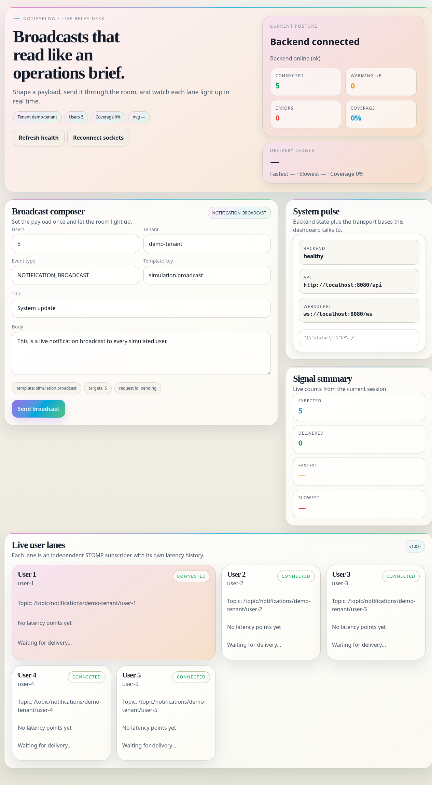
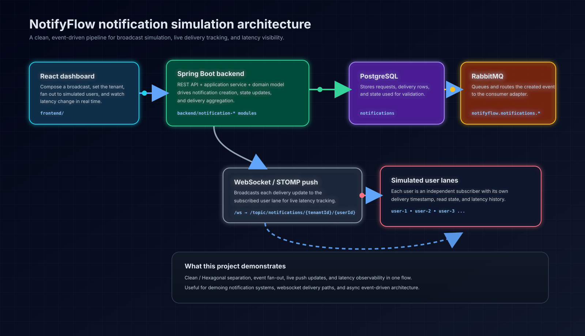
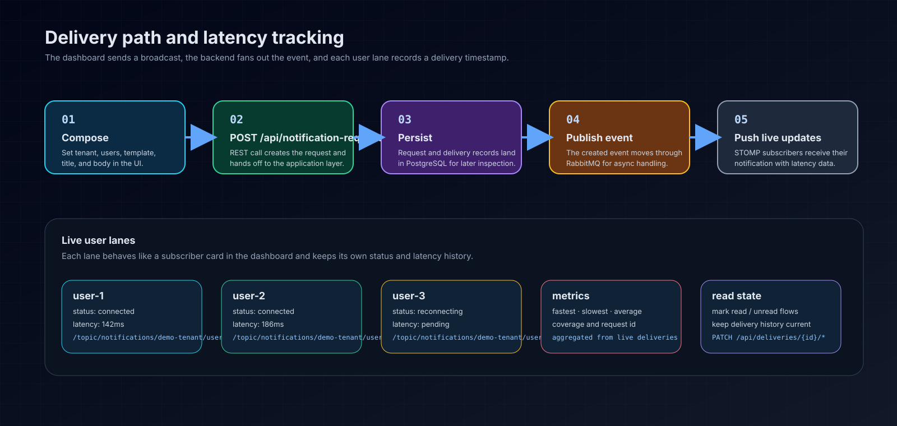

# NotifyFlow Notification Latency Simulator

[](https://www.oracle.com/java/)
[](https://spring.io/projects/spring-boot)
[](https://react.dev/)
[](https://www.rabbitmq.com/)
[](https://www.postgresql.org/)
[](https://stomp.github.io/)

NotifyFlow is an event-driven notification simulation system for broadcasting notifications, pushing them to live user lanes, and measuring end-to-end delivery latency in real time.

## Screenshots

### Dashboard overview



### System architecture



### Delivery flow



## What it shows

- A clean / hexagonal Spring Boot backend
- A React + TypeScript dashboard for composing broadcasts
- RabbitMQ-based async fan-out
- PostgreSQL persistence for requests and delivery records
- WebSocket/STOMP live updates for each simulated user lane
- Latency visibility with fastest, slowest, average, and coverage metrics

## Stack

| Layer | Tech |
|---|---|
| Backend | Java 25, Spring Boot, Gradle |
| Frontend | React, Vite, TypeScript |
| Messaging | RabbitMQ |
| Storage | PostgreSQL |
| Realtime push | WebSocket / STOMP |

## How the project is organized

- `backend/`
  - `notification-domain` — pure domain model
  - `notification-application` — use cases and ports
  - `notification-infrastructure` — Postgres, RabbitMQ, WebSocket adapters
  - `notification-api` — REST controllers and DTOs
  - `notification-bootstrap` — app wiring and runtime config
- `frontend/` — live simulation dashboard
- `docs/` — verification notes, deployment notes, and supporting documentation
- `docs/assets/` — diagram images and UI screenshots used in the README

## Core flow

1. Build a broadcast in the dashboard.
2. Send the request through `POST /api/notification-requests`.
3. Backend persists the request and creates delivery records.
4. Notification events are published to RabbitMQ.
5. The consumer adapter processes the event.
6. Live delivery updates are pushed to `/topic/notifications/{tenantId}/{userId}`.
7. The UI updates coverage and latency stats immediately.

## API and websocket contracts

- Health: `GET /actuator/health`
- Create notification: `POST /api/notification-requests`
- List deliveries: `GET /api/notification-requests/{notificationId}/deliveries`
- Mark read: `PATCH /api/deliveries/{deliveryId}/read`
- Mark unread: `PATCH /api/deliveries/{deliveryId}/unread`
- STOMP endpoint: `/ws`
- Topic pattern: `/topic/notifications/{tenantId}/{userId}`

### Sample create request

```json
{
  "tenantId": "demo-tenant",
  "eventType": "BROADCAST",
  "templateKey": "broadcast-template",
  "variables": {
    "title": "Hello",
    "body": "This is a simulation"
  },
  "userIds": ["user-1", "user-2", "user-3"]
}
```

## Quick start

### Backend

```bash
cd backend
./gradlew clean build

docker compose up -d
./gradlew :notification-bootstrap:run
```

### Frontend

```bash
cd frontend
npm install
npm run build
npm run dev
```

## Deployment

See `docs/deployment.md` for:
- Docker / Docker Compose deployment
- Render deployment
- Cloudflare Pages deployment for the frontend

## Docs

- `backend/README.md` — backend module breakdown and backend-only run steps
- `docs/verification.md` — end-to-end verification checklist
- `docs/deployment.md` — deployment guides
- `docs/assets/dashboard-overview.png` — screenshot of the live dashboard
- `docs/assets/architecture.svg` — architecture image
- `docs/assets/delivery-flow.svg` — delivery flow image

## Verified in this environment

- `backend`: `./gradlew clean build` ✅
- `frontend`: `npm run build` ✅
- `docker compose config` for PostgreSQL and RabbitMQ ✅
